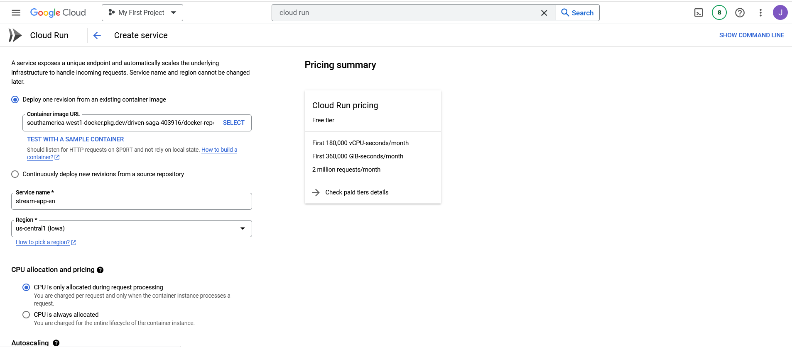

# Streamlit_app_docker_en

This is a tutorial to run Streamlit-apps in the Cloud Run service of **Google Cloud Platform (GCP)**. To deploy a Streamlit-app, docker images will be used, which are first tested locally and then migrated to the cloud environment. This tutorial assumes that you already have Docker installed, however below I leave you the link to download [Docker](https://www.docker.com/)

## Structure

The following project considers as main files and elements, the **Dockerfile** file, the **requirements.txt** file and **app_cloud_gcp_py.py**

The Dockerfile file will be the one with which we will build the image and then deploy it in a container, however the other files are necessary for the execution of the Streamlit-app.

``` docker
- 📁 Streamlit_app_docker
  - 📄 README.md
  - 📄 Dockerfile
  - 📄 app_cloud_gcp_py.py
  - 📄 requirements.txt
  - 💹 trip_austin.csv        
  - 📄 .gitignore
  - 🖼️ artifact_registry.png
  - 🖼️ cloud_run_1.png
  - 🖼️ cloud_run_2.png
  - 🖼️ cloud_run_3.png
  - 🖼️ create_repo.png
  - 🖼️ docker_1.png
  - 🖼️ image_app.png
  - 🖼️ image_repo_docker.png
      
```

### Dockerfile

The docker file can be modified depending on the type of application
be used.In this case if you want to continue working with Streamlit-apps,and
add other features, you can add the libraries that you are going to use in the **requirements.txt**.

``` docker
# app/Dockerfile

FROM python:3.9-slim

WORKDIR /app

RUN apt-get update && apt-get install -y \
    build-essential \
    curl \
    software-properties-common \
    git \
    && rm -rf /var/lib/apt/lists/*

COPY . .

RUN pip3 install -r requirements.txt

EXPOSE 8080


ENTRYPOINT ["streamlit", "run", "app_cloud_gcp_py.py", "--server.port=8080", "--server.address=0.0.0.0"]
```

## Build

To build the docker image called **stream_app**, the following line is used.

``` docker
docker build -t stream_app .
```

## Run

Once the **stream_app** image is ready, we execute the following line to run our image inside a container that will have port 8080 exposed.

``` docker
docker run -d -p 8080:8080 stream_app 
```
## Access to container

If all the previous steps were carried out correctly, the container should be running at the following address.

[127.0.0.1:8080](http://127.0.0.1:8080)


## Push Image

To migrate the already built image, we must first enable the Artifact Registry service on Google Cloud Platform. If we enable it correctly we should see the following screen.


Then in this service we can create a repository, which can be created from the GCP console or from the **Create Repository** menu.


When we create the repository we choose the format as Docker, the mode as standard and the region in this case I will set it to **southamerica-west1[Santiago]**.

Once the repository is created, we configure our docker locally to be able to push or pull the images.

``` dockerfile
gcloud auth configure-docker southamerica-west1-docker.pkg.dev
```

Then we have to tag our stream_app with the directory path of the cloud image repository.

``` dockerfile
docker tag stream_app:latest southamerica-west1-docker.pkg.dev/driven-saga-403916/docker-repo/stream_app:latest
```

Once the image has been tagged, we can push the image of our app.

``` dockerfile
docker push southamerica-west1-docker.pkg.dev/driven-saga-403916/docker-repo/stream_app:latest
```

If the image was uploaded correctly we can see it in the Artifact Registry repository as seen in the image.


As seen in the image, there are 2 images. The stream_app image is the one we just uploaded, however the one that says shiny_app is the image of an app that I uploaded previously.

## Deploy in Cloud Run

Once we access the Cloud Run service, we have to create a **service**, where the following menu will open.



From the service configuration menu we have to select in the first option **Container image URL**, the path where our image is located in the repository, then we assign the **Service Name** and the **Region** .

Below we select the value of 1 in the **Minimum number of instances** option, so that the first deployment is not so slow.

Also in the **Authentication** menu, we select the option ***Allow unauthenticated invocations***

Finally, in the last configuration module we select the value of 8080 in the **Container port** option, which corresponds to the port we assigned in the dockerfile.

If the image is displayed correctly, we should be able to see it as it looks in the image.


Finally, if we want to access the service, we can enter the URL shown in the image.

I leave them below.

<https://stream-app-en-vvrixyvk3q-uc.a.run.app/>

Here is a view of the stream app.


