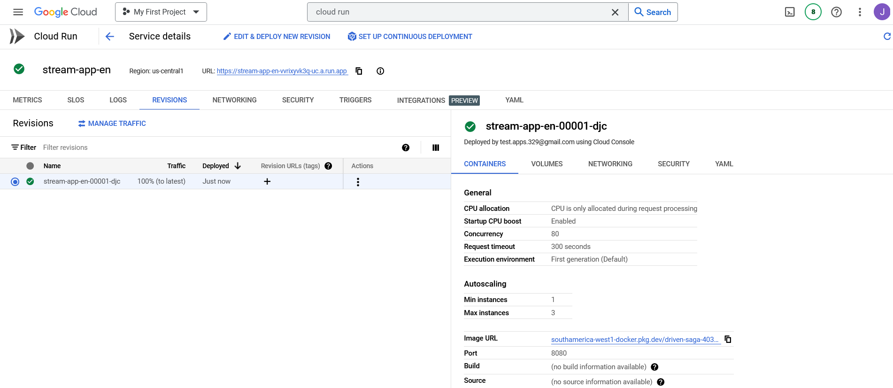

# Streamlit_app_docker
Este es un ejemplo básico para ejecutar Streamlit-apps en contenedores
Docker.Para ejecutar el contenedor que se muestra en este tutorial se
asume que Docker ya esta instalado.

Sin embargo a continuación te dejo el enlace para la descarga de [Docker](https://www.docker.com/)

## Estructura

El siguiente proyecto considera como archivos y elementos principales,el archivo **Dockerfile**,el archivo **requirements.txt** y **app_cloud_gcp_py.py**

El archivo Dockerfile sera con el que construiremos la imagen para luego desplegar en un contenedor,en cambio los otros archivos son necesarios para la ejecución de la Streamlit-app.

``` docker
- 📁 Streamlit_app_docker
  - 📄 README.md
  - 📄 Dockerfile
  - 📄 app_cloud_gcp_py.py
  - 📄 requirements.txt
  - 🖼️ docker_1.png
  - 💹 trip_austin.csv        
  - 📄 .gitignore
      
```

### Dockerfile

El archivo docker puede ser modificado segun el tipo de aplicación que
se utilice.En este caso si deseas seguir trabajando con Streamlit-apps,y
agregar otras features,puedes agregar las bibliotecas que vayas a utilizar en el **requirements.txt**.

``` docker
# app/Dockerfile

FROM python:3.9-slim

WORKDIR /app

RUN apt-get update && apt-get install -y \
    build-essential \
    curl \
    software-properties-common \
    git \
    && rm -rf /var/lib/apt/lists/*

COPY . .

RUN pip3 install -r requirements.txt

EXPOSE 8080


ENTRYPOINT ["streamlit", "run", "app_cloud_gcp_py.py", "--server.port=8080", "--server.address=0.0.0.0"]
```

## Build

Para construir la imagen docker llamada **stream_app**,se usa la siguiente linea.

``` docker
docker build -t stream_app .
```

## Run

Una vez lista la imagen **stream_app**,ejecutamos la siguiente linea para ejecutar nuestra imagen dentro de un contenedor que tendra expuesto el puerto 8080.

``` docker
docker run -d -p 8080:8080 stream_app 
```
## Acceso al contenedor

Si todos los pasos anteriores se desarrollaron de forma correcta,el contenedor se debe estar ejecutando en la siguiente dirección.

[127.0.0.1:8080](http://127.0.0.1:8080)


## Migrar imagen Docker

Para migrar la imagen ya construida,primero debemos habilitar el servicio Artifact Registry en Google Cloud Platform.Si lo habilitamos de forma correcta deberiamos ver la siguiente pantalla.


Luego en este servicio debemos crear un repositorio,el cual puede ser creado desde la consola de GCP o desde el menu **Create Repository**.En este caso utilizare uno que ya tengo creado.


Cuando creamos el repositorio elegimos el format como Docker,el mode como standar y la region en este caso la fijare en southamerica-west1[Santiago].

Una vez creado el repositorio configuramos de forma local nuestro docker para poder hacer push o pull a las imagenes.

``` dockerfile
gcloud auth configure-docker southamerica-west1-docker.pkg.dev
```

Luego tenemos que etiquetar a nuestra stream_app con la ruta del directorio del repositorio de imagenes en la nube.

``` dockerfile
docker tag stream_app:latest southamerica-west1-docker.pkg.dev/driven-saga-403916/docker-repo/stream_app:latest
```

Una vez etiquetada la imagen,le podemos dar a push a la imagen con la siguiente linea

``` dockerfile
docker push southamerica-west1-docker.pkg.dev/driven-saga-403916/docker-repo/stream_app:latest
```

Si la imagen fue cargada correctamente la podremos ver en el repositorio de Artifact Registry como se ve en la imagen.


Como podemos ver en la imagen,ya tenemos la imagen de nuestra app shiny.De esta forma ahora la podemos desplegar con el servicio Cloud Run.

## Desplegar con Cloud Run

Una vez accedemos al servicio Cloud Run,tenemos que crear un servicio en donde se abrira el siguiente menu.


Desde el menu de configuracion del servicio tenemos que seleccionar en la primera opcion **Container image URL**,la ruta en donde se encuentra nuestra imagen en el repositorio,luego asignamos el **Service Name** y la **Region**.

Mas abajo seleccionamos el valor de 1 en la opcion **Minimum number of instances**,para que el primer despliegue no sea tan lento.

Ademas en el menu **Authentication**,seleccionamos la opcion ***Allow unauthenticated invocations***

Finalmente en el último modulo de configuracion seleccionamos el valor de 8080 en la opcion **Container port**,que corresponde al puerto asignamos en el dockerfile.

Si la imagen se despliega de forma correcta,la deberiamos poder ver como se ve en la imagen.



Finalmente si queremos acceder al servicio,podemos entrar al URL que se nos muestra en la imagen.

Se los dejo a continuación.

<https://shiny-app-vvrixyvk3q-uc.a.run.app>

Aca se una vista de la shiny app.


